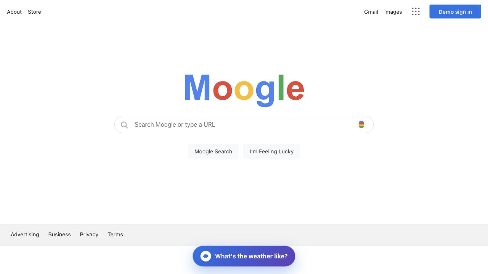
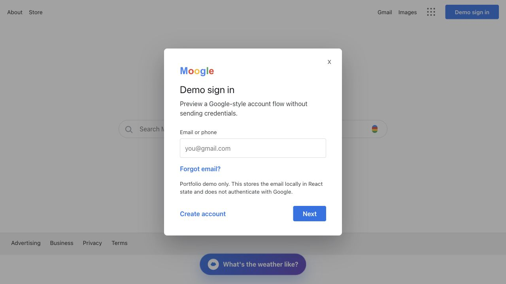
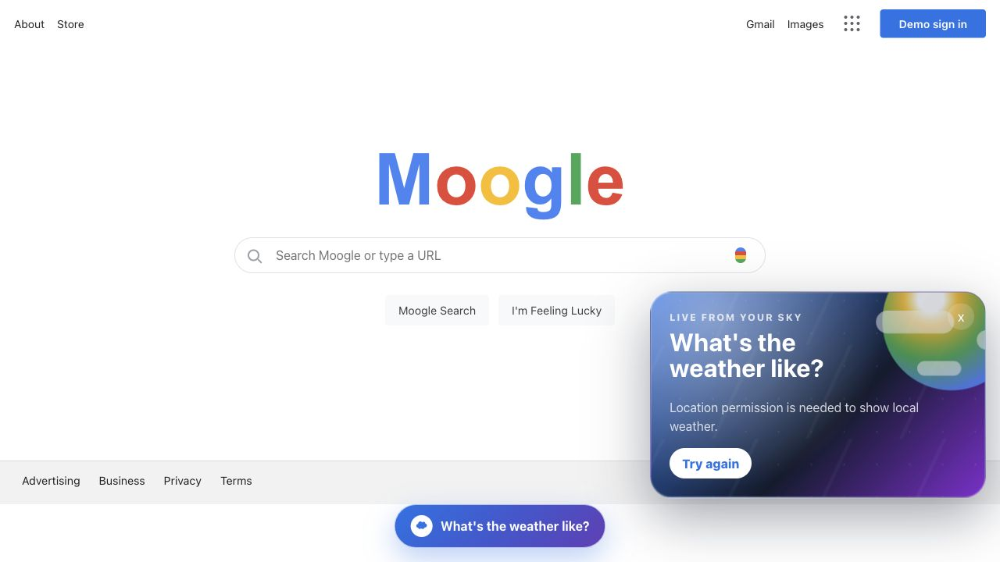

# Moogle

Moogle is a Google-inspired search UI built with React. It started as a familiar search-page clone, then grew into a portfolio piece with real web-search integration, an animated local weather drawer, a demo account modal, responsive styling, and focused tests.

## Portfolio Summary

This project demonstrates:

- React state management for search, modal, account, and weather UI
- Real in-app web results through Google Programmable Search JSON API
- Location-based weather through the Open-Meteo forecast API
- A Google-style search experience with search shortcuts and external service links
- Responsive layout polish for desktop and mobile
- User-friendly fallback states when API credentials or location permission are missing
- Regression tests for search, account modal, and weather behavior

## Screenshots

Screenshots live in `docs/screenshots`.







## Features

- Google-inspired landing page with Moogle branding
- Real Gmail, Images, About, Store, Advertising, Business, Privacy, and Terms links
- In-app web result rendering when Google Programmable Search credentials are configured
- Google fallback button when search credentials are not configured
- "I'm Feeling Lucky" shortcut to Google
- Demo-only sign-in modal that stores account state locally
- Animated weather drawer using browser geolocation and Open-Meteo

## Tech Stack

- React
- Create React App
- Google Programmable Search JSON API
- Open-Meteo Forecast API
- Vercel deployment config
- Testing Library

## Environment Setup

Copy `.env.example` to `.env.local` and add your Google Programmable Search credentials:

```bash
REACT_APP_GOOGLE_SEARCH_API_KEY=your_api_key_here
REACT_APP_GOOGLE_SEARCH_ENGINE_ID=your_search_engine_id_here
```

Without these values, Moogle still runs and shows a setup state with a Google fallback search button.

## Local Development

```bash
npm install
npm start
```

The app runs locally at `http://localhost:3000` unless that port is already occupied.

## Testing

```bash
npm test -- --watchAll=false
```

## Production Build

```bash
npm run build
```

## Deploy

This project includes `vercel.json` and deploy scripts:

```bash
npm run deploy
```

In Vercel, add these environment variables for real in-app search:

- `REACT_APP_GOOGLE_SEARCH_API_KEY`
- `REACT_APP_GOOGLE_SEARCH_ENGINE_ID`

## Notes

The sign-in modal is intentionally a demo flow. It does not authenticate with Google and does not send credentials anywhere. Real Google authentication would require OAuth client credentials and a proper auth flow.
